# 《Clash下载与使用说明》


## 根据自己的电脑版本对应选择下载

### Windows版本

1. 下载

    下载地址：https://github.com/clash-verge-rev/clash-verge-rev

    进入页面后，点击右边的release进入下载地址。
    （我的电脑是64版本，所以下载x64版本）

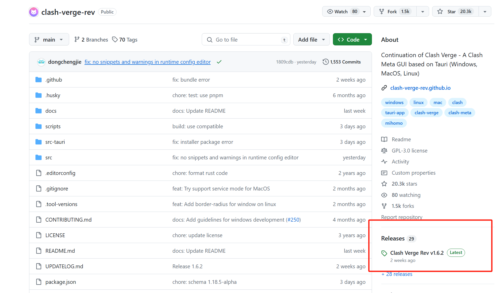
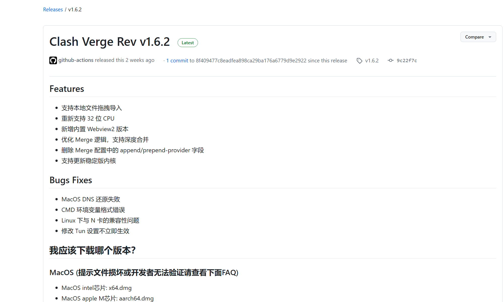
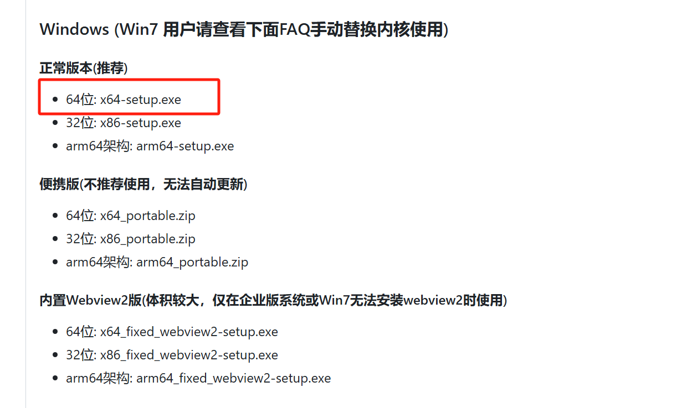

（根据自己电脑的版本对应下载）
（鼠标右键，选择属性，可以看到电脑对应的版本）


2. 下载完成后，运行安装

    一直点击下一步，选位置安装就可以了，和其他软件安装一样

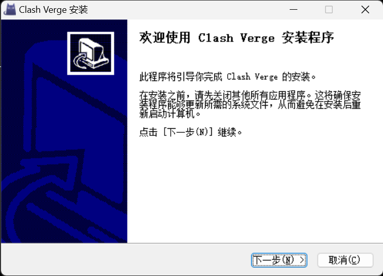


### Mac版本

1. 下载

    下载地址：https://github.com/clash-verge-rev/clash-verge-rev

    进入页面后，点击右边的release进入下载地址，选择对应的版本下载。
    （可以通过终端指令看自己电脑是什么芯片。）
    

    ```sysctl -n machdep.cpu.brand_string```

    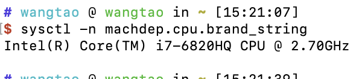

2. 下载后安装


## 设置运行软件

>mac版本界面和Windows版本界面相似，设置的内容相同，这里以Windows界面为例）    
>软件运行需要对应的链接码，根据收到的链接码格式不同，分别对应操作：

1. 如果收到的是链接文件，把文件后缀改为yaml，如果是链接直接复制
    
    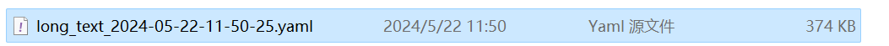

2. 运行软件后，点击订阅，
    1. 如果收到的是链接文件，则选择新建，类型选择Local，点击选择文件添加。

        （下图分别为mac版本和Windows版本的界面。）
    
    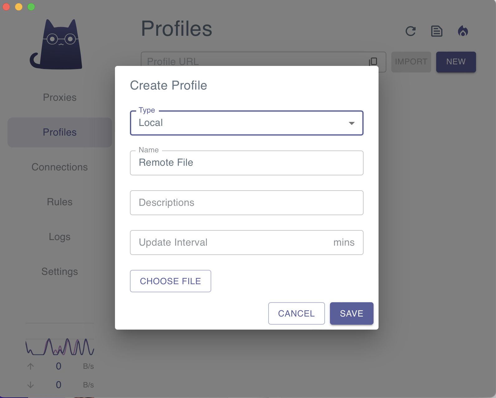
    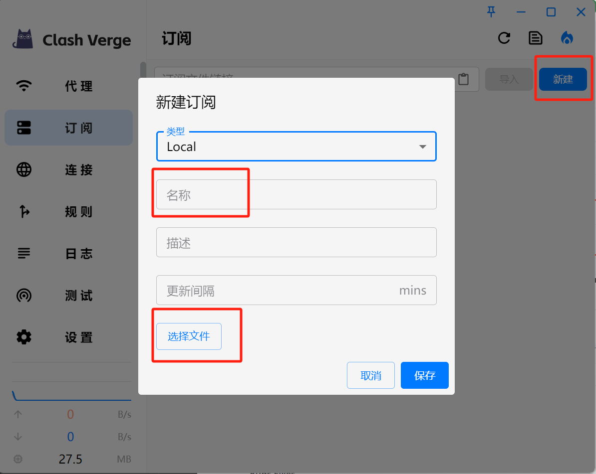

    2. 如果是对应连接，直接把链接粘在导入栏中，点击导入。


3. 导入完成后，右键刚添加的订阅选项，选择使用，使用后，右上角会弹出refresh选项。

    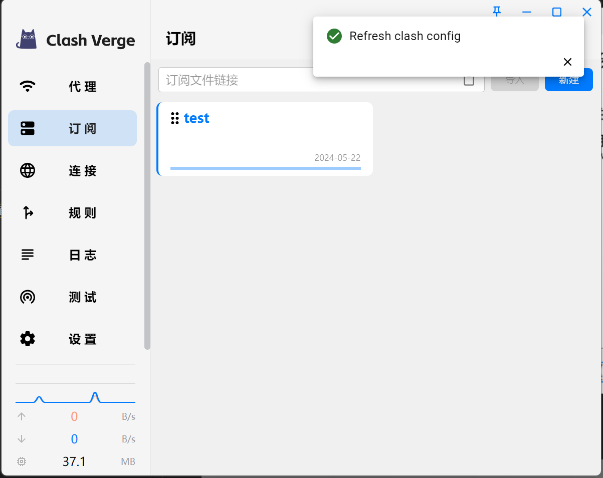

5. 点击设置，把系统代理和Turn模式选项打开。

    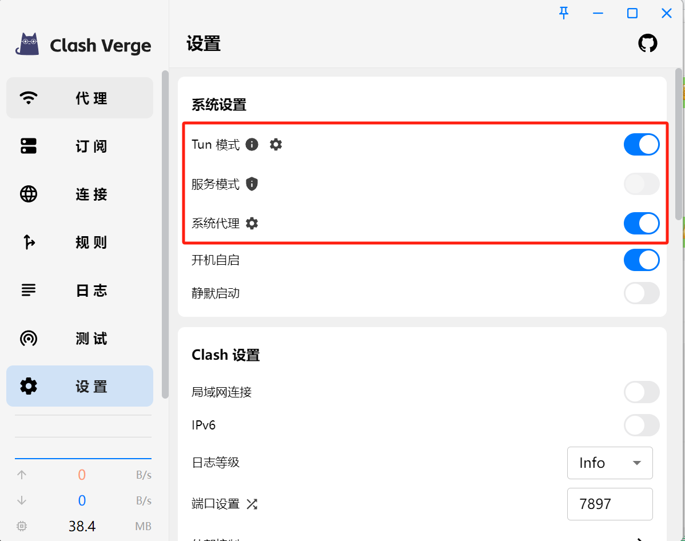
   
6. 重启一下软件，确保设置运行。

7. 点回代理，对应会出现可选的地址，可点击测速按钮，选择稳定快速的地址进入。

    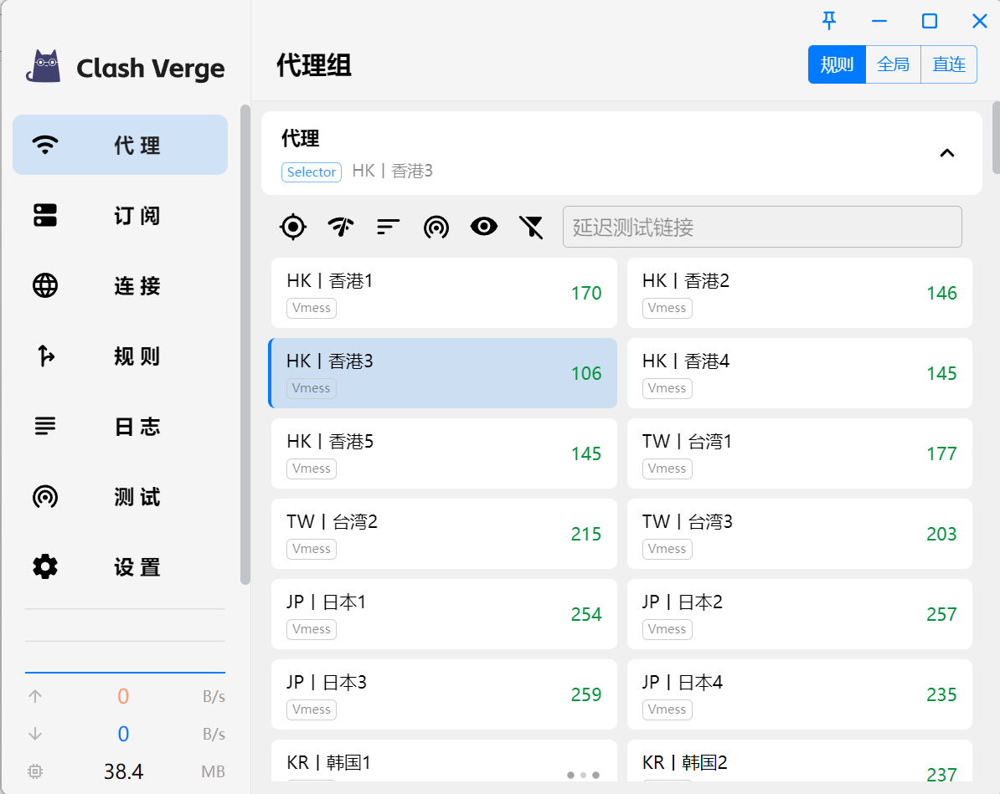
